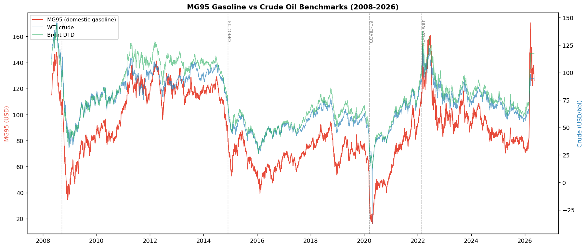
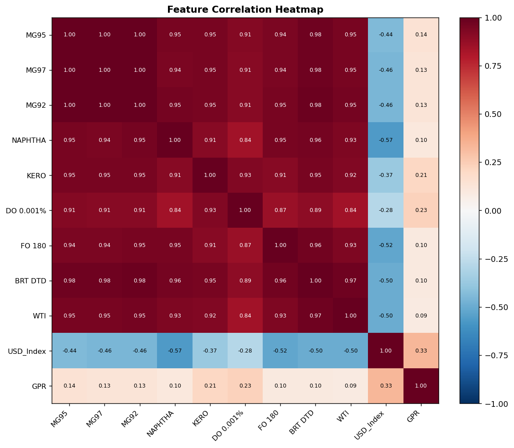
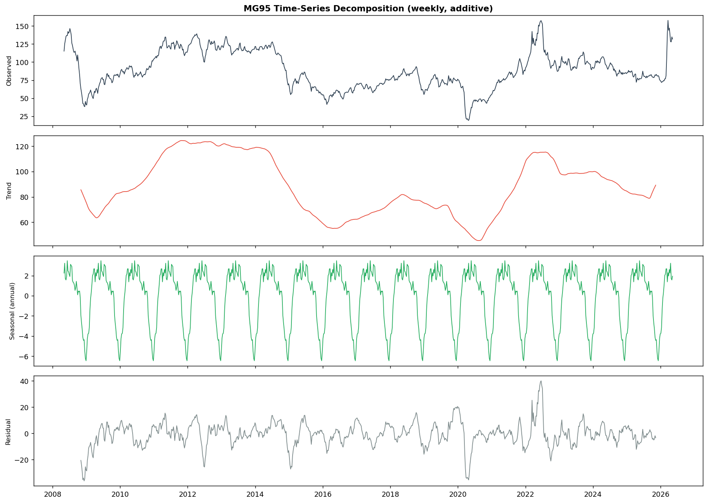
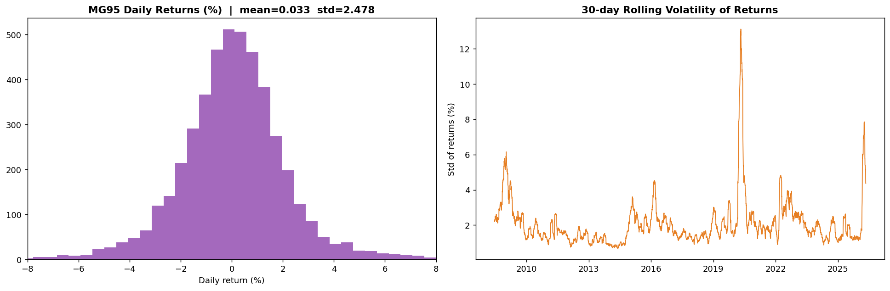
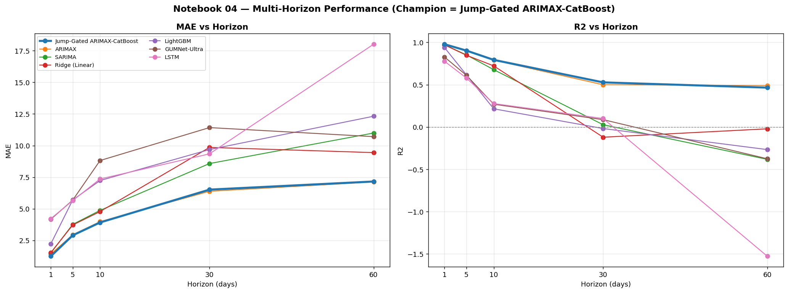
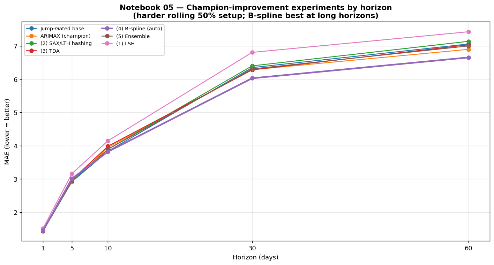

# Oil-Forecasting

**Forecasting four refined-fuel price series (MG95, MG92, DO 0.001%, DO 0.05%) with time-series and
machine-learning models — from global crude benchmarks, macro indicators, and news sentiment.**

[](https://www.python.org/)
[](https://pytorch.org/)
[](https://opensource.org/licenses/Apache-2.0)
[](https://jupyter.org/)

| | |
|---|---|
| **Targets** | MG95, MG92, DO 0.001%, DO 0.05% |
| **Horizons** | H = 1, 5, 10, 30, 60 trading days |
| **Models compared** | 9 (statistical, regression, boosting, deep learning, hybrid) |
| **Champion** | Jump-Gated ARIMAX → CatBoost |
| **Best score (MG95, H=1)** | **MAE 1.2571 · RMSE 2.6541 · MAPE 1.2615% · SMAPE 1.2603% · R² 0.9779** |
| **Data span** | 2008-05-01 → 2026-05-08 (daily) |

---

## 1. Overview & Introduction

Oil-Forecasting predicts the daily price of Vietnamese refined-fuel products from a panel of
global drivers — WTI and Brent crude, the US Dollar Index, the Geopolitical Risk index (GPR),
and a custom **news-sentiment** signal built from war / political-economy / natural-disaster
headlines. The project combines classical statistical models, gradient boosting, deep-learning
sequence models, and a hybrid **Jump-Gated ARIMAX → CatBoost** champion, evaluated across five
forecast horizons.

The motivation is practical: refined-fuel prices track crude with a lag and a refining margin
(the *crack spread*), but they also jump on macro shocks and geopolitical events. A model that
blends a strong linear backbone (ARIMAX) with a non-linear residual learner (CatBoost), gated by
recent volatility, captures both the smooth co-movement and the shock-driven jumps.

*(All work is reproducible from the staged dataset and the `src/` pipeline; the notebooks
`01`–`05` document EDA, baseline modeling, the full model suite, the multi-horizon study, and
champion-improvement experiments.)*

---

## 2. Data

The main dataset lives at `data/processed/clean_data_exo_ver1.csv` — **4,649 rows × 18 columns**, daily,
2008-05-01 → 2026-05-08, ordered by date and never randomly shuffled when splitting.

| Group | Main variables |
|---|---|
| **Targets** | MG95; MG92; DO 0.001%; DO 0.05% |
| **Fuel products** | MG97; NAPHTHA; KERO; FO 180 |
| **Crude** | WTI; BRT DTD; BRT KH; Brent_EU_Daily |
| **Economy & risk** | USD_Index; GPR |
| **Daily news** | per-topic news count, sentiment, and intensity |

Descriptive statistics of the targets:

| Statistic | MG95 | MG92 | DO 0.001% | DO 0.05% |
|---|---|---|---|---|
| Mean | 88.69 | 85.85 | 92.44 | 92.51 |
| Std | 25.86 | 25.46 | 29.53 | 30.43 |
| Min | 16.12 | 14.64 | 22.92 | 20.75 |
| Median | 84.33 | 81.67 | 87.02 | 87.40 |
| Max | 170.52 | 157.20 | 292.82 | 291.82 |

`daily_features.csv` stores news features aggregated per day. If a day has no news the value is filled
with 0 on join. News is a **supplementary** source — it does not replace prices and market variables.

---

## 3. Exploratory Data Analysis (EDA)

MG95 is used as the representative series; the same steps apply to the other three products.

### 3.1 Trend and volatility periods

MG95 and crude move together over many stretches. The 2008, 2014–2016, 2020, and 2022 episodes are clear.
The 2026 tail shows a fast increase, so test-region error can be affected by a price-regime change.



### 3.2 Correlation between variables

MG95 correlates highly with MG92, MG97, Brent, and WTI: **MG95–MG92 = 0.9988**, **MG95–BRT DTD = 0.9757**,
**MG95–WTI = 0.9483**. USD Index is negatively correlated; GPR is positive but lower.



### 3.3 Trend, seasonality, residual

The trend component shifts across periods. The 52-week seasonal component has a smaller amplitude than the
trend and the irregular shocks. Residuals rise in some periods — a trend/seasonality-only model cannot
describe the whole movement.



### 3.4 Stationarity

ADF on raw MG95: statistic **−3.1961**, p-value **0.0202**. After first differencing, p-value ≈ 0. This
supports differencing in ARIMA / SARIMA / ARIMAX.

### 3.5 Autocorrelation and lags

ACF decays slowly (today's price relates to many past values); PACF stands out at the early lags. From
this, the project builds lag features at **1, 2, 3, 5, 7, 14, 30** days and lets the statistical models
learn the lag structure.

### 3.6 Exogenous lead/lag

Within 0–20 days, USD Index peaks at **lag 1 (corr −0.4296)** and GPR at **lag 6 (corr 0.1644)**. These
guide feature design — they are not treated as proof of direct causation.



### 3.7 Anomalies and event context

By the IQR rule the series has one point above the upper threshold. The chart marks market shifts: the
2008 crisis, the 2014–2016 glut, COVID-19, and the Russia–Ukraine conflict. These explain why **RMSE can
rise faster than MAE** — a few days carry much larger errors.

---

## 4. Preprocessing & Feature Engineering

### 4.1 Chronological split

The data is split **80% train / 10% validation / 10% test** in time order — preserving past→future order
and avoiding leakage. After lags and rolling features, the modeling table has **4,619 rows × 52 columns**.

### 4.2 Feature groups

| Group | Examples & purpose |
|---|---|
| **Lags** | Lag 1, 2, 3, 5, 7, 14, 30 days; bring recent history into the model. |
| **Mean & volatility** | Rolling mean/std over 7 and 30 days; short trend and dispersion. |
| **Rate of change** | ROC 7 and 30 days; speed of price change. |
| **Price spreads** | Crack Spread and Brent–WTI Spread; relationships between series. |
| **Time** | Month, quarter, day-of-week, and sin/cos encodings. |
| **News** | Count, sentiment, intensity, and sums over 3 / 7 / 14-day windows. |
| **Price-change day** | Days since last price change, last change magnitude, change-day flag. |

Features are built in memory at run time; the raw file is read-only, and outputs are written to `results/`.

---

## 5. Models Trained

| Model | Role in the experiment |
|---|---|
| **SARIMA** | Time-series model with differencing and a seasonal component. |
| **ARIMAX** | ARIMA plus exogenous variables (WTI, Brent, USD Index, GPR). |
| **Ridge (Linear)** | Regularized linear regression on the engineered features. |
| **LightGBM** | Gradient-boosted trees; non-linear feature relationships. |
| **LSTM** | Sequential neural network over a past-data window. |
| **iTransformer** | Transformer for multivariate time series. |
| **GUMNet-Lite** | Compact version of GUMNet. |
| **GUMNet-Ultra** | Larger-configuration GUMNet. |
| **Jump-Gated ARIMAX-CatBoost** | ARIMAX baseline; CatBoost learns the residual and a gate adjusts on price-change signals. |

### 5.1 How the hybrid works

1. ARIMAX forecasts the baseline price from history and exogenous variables.
2. Compute the gap between the true price and the ARIMAX forecast on the training data.
3. CatBoost learns that gap from market, news, and price-change-state features.
4. A jump-detection branch decides how much correction to add to the final forecast.
5. Final forecast = ARIMAX forecast + CatBoost correction.

CatBoost does not merely check the error — it learns the error's pattern on the training set and produces
a correction for each new observation.

---

## 6. Evaluation Methodology

| Metric | Reading |
|---|---|
| **Statistical** | ARIMAX, SARIMA (rolling one-step / H-step via `extend`) |
| **Linear / tree** | Ridge / Linear Regression, LightGBM (Optuna-tuned); Logistic Regression for up/down direction |
| **Deep learning** | LSTM, iTransformer (inverted attention), GUMNet-Lite & GUMNet-Ultra (gated CNN-BiGRU mixture-of-experts), PatchTST, TFT |
| **Champion (hybrid)** | **Jump-Gated ARIMAX → CatBoost**: ARIMAX gives the linear + exogenous forecast, CatBoost learns the non-linear **residual**, and a **Jump Gate** (sigmoid of recent-volatility z-score) controls how much residual correction to apply during turbulent periods |

**Champion-improvement experiments (Notebook 05)** add five residual-side techniques on top of the
champion: (1) **LSH** analog residuals, (2) **SAX + date→text + Log-Transform Hashing**, (3)
**Topological Data Analysis** (sublevel-set persistence + Takens embedding — "Sequence" + "Star"),
(4) **B-spline** basis with automatic quantile knots, and (5) an **NNLS stacking ensemble**.

---

## 11. Tech Stack & Libraries

| Layer | Tools |
|---|---|
| **Language / runtime** | Python (DL environment), Node.js 22 (news crawler) |
| **Data** | pandas, numpy, scipy |
| **Statistical** | statsmodels (SARIMAX) |
| **ML** | scikit-learn, LightGBM, CatBoost, Optuna |
| **Deep learning** | TensorFlow / Keras (LSTM, iTransformer, GUMNet); PyTorch + neuralforecast (PatchTST, TFT) |
| **Signal / topology** | scipy splines & MST, custom SAX / LSH / sublevel-persistence |
| **News sentiment** | OpenAI client → MiniMax-M3 (via TokenRouter) |
| **Viz** | matplotlib, seaborn |

Environment setup: `setup_env.ps1` / `setup_env.bat` + `requirements-py39.txt`, verified by
`verify_env.py`. See `SETUP.md`.

---

## 7. Results & Insights (MG95)

### 7.1 Multi-horizon

**Jump-Gated ARIMAX-CatBoost is the project's single best model** — it wins at H = 1, 5, 10 and is
competitive at 30 / 60. Best score at H=1: **MAE 1.2571; R² 0.9779**. Deep-learning models
consistently underperform on this dataset.



MAE (lower is better) / R² (higher is better) by horizon:

| Model | H=1 | H=5 | H=10 | H=30 | H=60 |
|---|---|---|---|---|---|
| **Jump-Gated ARIMAX-CatBoost** | **1.257 / 0.978** | **2.906 / 0.903** | **3.923 / 0.793** | 6.518 / **0.527** | 7.161 / 0.465 |
| ARIMAX | 1.429 / 0.975 | 2.953 / 0.899 | 3.992 / 0.789 | **6.390** / 0.500 | **7.122 / 0.490** |
| SARIMA | 1.511 / 0.971 | 3.770 / 0.852 | 4.879 / 0.677 | 8.580 / 0.027 | 10.99 / −0.38 |
| Ridge (Linear) | 1.542 / 0.970 | 3.725 / 0.848 | 4.786 / 0.722 | 9.855 / −0.12 | 9.446 / −0.02 |
| LightGBM | 2.237 / 0.938 | 5.704 / 0.616 | 7.238 / 0.215 | 9.685 / −0.02 | 12.32 / −0.27 |
| GUMNet-Ultra (best DL) | 4.179 / 0.827 | 5.692 / 0.611 | 8.819 / 0.269 | 11.42 / 0.087 | 10.71 / −0.38 |
| LSTM | 4.226 / 0.777 | 5.653 / 0.579 | 7.360 / 0.277 | 9.345 / 0.100 | 18.01 / −1.53 |

### 7.2 Champion-improvement experiments

Notebook 05 stress-tests five residual-side enhancements on a **harder evaluation setup** (ARIMAX
fit on the first 50% and rolled H-step over the remaining ~50% — a much longer test window than
nb04's last-10%). Scores are therefore higher than nb04 and **not directly comparable**; this
notebook ranks *which enhancement helps*, not the headline accuracy.

The winner shifts with horizon: the **ensemble** edges H=1, the **Jump-Gated base** wins H=5, and
**B-spline (auto knots)** dominates the long horizons (H=10/30/60) — confirming that the topological
/ basis features pay off in the shock-driven, longer-horizon regime. **LSH consistently hurts.**



Best MAE per horizon (Notebook 05 setup):

| Horizon | Best technique | MAE | R² |
|---|---|---|---|
| H=1 | (5) Ensemble (NNLS stack) | 1.434 | 0.974 |
| H=5 | Jump-Gated ARIMAX-CatBoost (base) | 2.915 | 0.902 |
| H=10 | (4) B-spline (auto) | 3.819 | 0.802 |
| H=30 | (4) B-spline (auto) | 6.028 | 0.518 |
| H=60 | (4) B-spline (auto) | 6.654 | 0.485 |

> The single best result of the whole project remains **Notebook 04's Jump-Gated ARIMAX-CatBoost at
> H=1 (MAE 1.2571, R² 0.9779)** — nb05's numbers come from a deliberately harder rolling setup.

### 7.3 Four-target summary

R² / MAPE(%) on the test set, full `main.py` pipeline:

| Target | LightGBM | iTransformer | GUMNet-Ultra |
|---|---|---|---|
| **MG95** | **0.943 / 2.21** | 0.806 / 3.46 | 0.938 / 2.40 |
| **MG92** | 0.933 / 2.77 | 0.867 / 3.60 | **0.937 / 2.22** |
| **DO 0.001%** | **0.795 / 3.31** | 0.591 / 5.42 | 0.754 / 4.00 |
| **DO 0.05%** | 0.720 / 3.34 | 0.598 / 5.42 | **0.807 / 4.04** |

### Key insights

- **Simpler wins.** The linear-backbone hybrid (ARIMAX + CatBoost residual) beats every deep
  model. Refined-fuel prices are dominated by lag-1 autocorrelation and crude co-movement, which a
  strong linear model captures almost fully at short horizons.
- **The Jump Gate adds the most at mid horizons (H = 5–10)**, exactly where ARIMAX starts to
  decay but structure still exists.
- **Signal decays sharply with horizon** - R² falls from ~0.98 (H=1) to ~0.49 (H=60). Beyond ~30
  days the series is close to a random walk and all models converge toward the naive baseline.
- **News + topological / symbolic features** give marginal H=1 gains but are aimed at the
  shock-driven tail; their value grows at longer horizons and in crisis windows.

---

## 8. Project Structure

```
Oil-Forecasting/
├── README.md                  (this report)
├── SETUP.md                   environment setup guide
├── main.py                    full 4-target pipeline entry point
├── requirements-py39.txt      pinned dependencies
├── setup_env.ps1 / .bat       one-command environment setup
├── verify_env.py              environment checker
├── data/processed/            clean_data_exo_ver1.csv (market + macro panel)
├── src/                       data_loader, features, evaluation, models/
├── notebooks/                 01 EDA - 02 baseline - 03 all-models - 04 multi-horizon - 05 champion-improvements
├── news-crawler/              Node + Python news sentiment pipeline (crawl -> score -> aggregate)
├── results/                   metrics CSVs + charts/ (per-model & per-target)
└── docs/images/               figures used in this report
```

---

## References

1. Box, G. E. P., Jenkins, G. M., Reinsel, G. C., & Ljung, G. M. (2015). *Time Series Analysis: Forecasting and Control* (5th ed.). Wiley.
2. Hyndman, R. J., & Athanasopoulos, G. (2021). *Forecasting: Principles and Practice* (3rd ed.). OTexts. https://otexts.com/fpp3/
3. Seabold, S., & Perktold, J. (2010). *Statsmodels: Econometric and statistical modeling with Python*. SciPy 2010. https://www.statsmodels.org/
4. Pedregosa, F., et al. (2011). *Scikit-learn: Machine learning in Python*. JMLR, 12, 2825–2830. https://scikit-learn.org/
5. Ke, G., et al. (2017). *LightGBM: A highly efficient gradient boosting decision tree*. NeurIPS 30. https://lightgbm.readthedocs.io/
6. Prokhorenkova, L., et al. (2018). *CatBoost: Unbiased boosting with categorical features*. NeurIPS 31. https://catboost.ai/docs/
7. Hochreiter, S., & Schmidhuber, J. (1997). *Long short-term memory*. Neural Computation, 9(8), 1735–1780.
8. Liu, Y., et al. (2024). *iTransformer: Inverted transformers are effective for time series forecasting*. ICLR 2024.

---

## Contact

For more details, reach out to:

* **Nguyễn Hữu Tuấn Phát** - Email: [tuanphatnguyenhuu@gmail.com](mailto:tuanphatnguyenhuu@gmail.com)
* **Trần Mạnh Hùng**
* **Nguyễn Phước Toàn**
* **Supervising lecturer**: Dr. Hoàng Văn Quý


