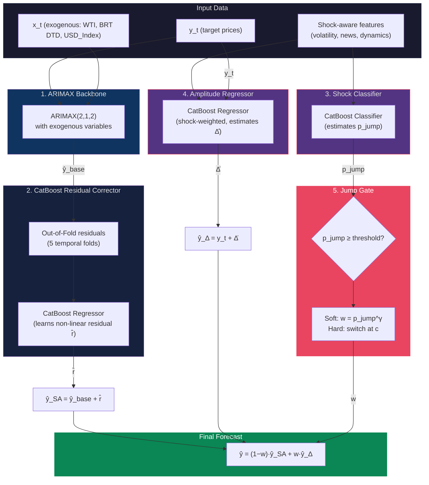

# Oil-Forecasting

**Forecasting four refined-fuel price series (MG95, MG92, DO 0.001%, DO 0.05%) with a hybrid
Jump-Gated ARIMAX–CatBoost model — from global crude benchmarks, macro indicators, and news sentiment.**

[](https://www.python.org/)
[](https://pytorch.org/)
[](https://jupyter.org/)

| | |
|---|---|
| **Targets** | MG95, MG92, DO 0.001%, DO 0.05% |
| **Horizons** | H = 1, 5, 10, 15, 20, 30, 60 trading days |
| **Models compared** | 9 (statistical, regression, boosting, deep learning, hybrid) |
| **Champion** | Jump-Gated ARIMAX–CatBoost |
| **Best score (MG95, H=1)** | **MAE 1.0608 · RMSE 2.7247 · MAPE 1.02% · SMAPE 1.02% · R² 0.9767** |
| **Data span** | 2008-05-01 → 2026-05-08 (4,649 daily rows) |

---

## 1. Overview & Introduction

Oil-Forecasting predicts the daily price of Vietnamese refined-fuel products from a panel of
global drivers — WTI and Brent crude, the US Dollar Index, and a custom **news-sentiment** signal
built from war / political-economy / natural-disaster headlines.

The motivation is practical: refined-fuel prices track crude with a lag and a refining margin
(the *crack spread*), but they also jump on macro shocks and geopolitical events. Three core
challenges drive the design:

1. **Co-movement with crude** — prices co-integrate with crude oil but diverge due to time-varying
   crack spreads, causing severe multicollinearity at level.
2. **Fat-tailed daily changes** — kurtosis ≈ 22 for MG95 daily returns; ~20% of days have
   |Δprice| ≥ 2 USD. Standard Gaussian assumptions fail.
3. **Long-horizon instability** — ML/DL models overfit on a few thousand daily data points and
   collapse (R² < 0) at H ≥ 20 days.

The project's champion model, **Jump-Gated ARIMAX–CatBoost**, blends a strong linear backbone
(ARIMAX) with a non-linear residual learner (CatBoost), gated by a shock-detection mechanism.
It achieves MAPE 1.02% at H=1 for MG95 and maintains positive R² across all seven horizons.

*(All work is reproducible from the staged dataset and the `src/` pipeline; the notebooks
`01`–`05` document EDA, baseline modeling, the full model suite, the multi-horizon study, and
champion-improvement experiments.)*

---

## 2. Data

> **Dataset version: `data_exo_ver2`** — this is the current dataset used for all experiments.
> The older `clean_data_exo_ver1.csv` is deprecated.

The main dataset is `data/processed/data_exo_ver2.csv` — **4,649 rows**, daily,
2008-05-01 → 2026-05-08, ordered by date and never randomly shuffled when splitting.

| Group | Main variables |
|---|---|
| **Targets** | MG95; MG92; DO 0.001%; DO 0.05% |
| **Fuel products** | MG97; NAPHTHA; KERO; FO 180 |
| **Crude** | WTI; BRT DTD (Brent Dated) |
| **Macro** | USD_Index |
| **Daily news** | per-topic news count, sentiment, and intensity |

`daily_features.csv` stores news features aggregated per day (6,583 rows), with counts, average
sentiment, total sentiment, and intensity for each topic group: war, political-economy, natural
disaster, and aggregate. If a day has no news, the values are filled with 0 on join.

### Key changes in ver2 (vs ver1)

- **Frozen crude columns fixed**: WTI was stuck at a constant value for the last ~30 days; replaced
  with actual closing prices. BRT DTD and USD_Index similarly refreshed from market data (regression
  mapping from Brent futures / dollar index), so exogenous signals in the 2026 shock window reflect
  reality.
- **Redundant columns removed**: near-duplicate Brent variants (BRT KH, Brent_EU_Daily) and monthly
  smoothed versions dropped to reduce multicollinearity.
- **GPR column removed**: weak correlation and not independently informative after news sentiment
  features were added.

### Descriptive statistics (targets, USD)

| Statistic | MG95 | MG92 | DO 0.001% | DO 0.05% |
|---|---|---|---|---|
| Mean | 88.69 | 85.85 | 92.44 | 92.51 |
| Std | 25.86 | 25.46 | 29.53 | 30.43 |
| Min | 16.12 | 14.64 | 22.92 | 20.75 |
| Median | 84.33 | 81.67 | 87.02 | 87.40 |
| Max | 170.52 | 157.20 | 292.82 | 291.82 |

Diesel (DO) has higher standard deviation and a wider upper tail than gasoline (MG), reflecting
more extreme price spikes.

---

## 3. Exploratory Data Analysis (EDA)

MG95 is used as the representative series; the same patterns apply to the other three targets.

### 3.1 Price overview and historical episodes

MG95 and crude move together across major episodes: the 2008 financial crisis, the 2014–2016 supply
glut, COVID-19 (2020), the Russia–Ukraine conflict (2022), and a fast price increase in the 2026
tail — the test set covers this last regime shift.


### 3.2 Correlation between variables

MG95 correlates very highly with MG92, MG97, Brent, and WTI:

| Pair | Correlation |
|---|---|
| MG95 – MG92 | ≈ 0.999 |
| MG95 – BRT DTD | ≈ 0.976 |
| MG95 – WTI | ≈ 0.948 |
| MG95 – USD_Index | negative, weak |

The extremely high cross-correlation within the price cluster is the main reason for using
**differenced** features rather than raw levels, and for careful feature selection.


### 3.3 Trend, seasonality, residual decomposition

Additive decomposition of MG95 (365-day seasonal cycle) shows:
- The **trend** component dominates and shifts across periods.
- The **seasonal** component has much smaller amplitude than trend and shocks.
- **Residuals** spike in shock periods — explaining why RMSE grows faster than MAE.

A trend/seasonality-only model is insufficient.


### 3.4 Stationarity

ADF test on raw MG95: statistic **−3.34**, p ≈ **0.013**. After first differencing: p ≈ 3×10⁻²⁹.
This strongly supports using integration order d=1 in ARIMA/ARIMAX models.

### 3.5 Autocorrelation and lags

- **ACF** of raw MG95 decays slowly (today's price relates to many past values).
- **PACF** is prominent at early lags only.
- After differencing, the autocorrelation structure shortens significantly, suggesting low AR/MA
  orders — hence ARIMAX(2,1,2).

### 3.6 Cross-correlation (lead/lag with exogenous variables)

Cross-correlation analysis on differenced series between exogenous variables and MG95 guides
feature engineering for lag selection. These are descriptive — not causal claims.

### 3.7 Shocks and fat tails

Daily price changes of MG95 exhibit:
- **Kurtosis ≈ 22** — extremely fat tails vs. a Gaussian distribution.
- **~20% of days** have |Δprice| ≥ 2 USD ("shock days").

This empirical finding motivates the **shock-awareness mechanism** in the proposed model.

### 3.8 News sentiment signal

Monthly aggregation of news volume and intensity by topic group (war, political-economy, natural
disaster) shows that intensity peaks align with periods of high price volatility, validating the
use of news features as a supplementary shock signal.

---

## 4. Preprocessing & Feature Engineering

### 4.1 Data cleaning

Key cleaning steps:
1. Column-name normalization and date parsing; time-sorted ordering.
2. Replace ±∞ with NaN; cautious forward/backward fill.
3. **Frozen crude column repair**: WTI, BRT DTD, and USD_Index values that were stuck (forward-filled
   by the upstream data source) in the 2026 tail are replaced with actual market data via
   date-matched close prices or regression mapping. Without this fix, exogenous signals are "flat"
   while target prices swing wildly — breaking learned relationships.

### 4.2 Chronological split

The data is split **80% train / 10% validation / 10% test** in strict time order — preserving the
past→future ordering and preventing information leakage. The test set covers the 2026 price-shock
window.

### 4.3 Feature groups

| Group | Examples & purpose |
|---|---|
| **Seasonality** | sin/cos encodings of day-of-year for annual cycle. |
| **Shock dynamics** | Days since last price change, last-change magnitude, change-day flag; for each exogenous variable: 1st difference, cumulative difference, and rolling volatility (std) over {3, 7, 14, 30}-day windows; cumulative exogenous move since last price change. |
| **Target volatility** | Absolute daily change sum and rolling std over {3, 7, 14, 30}-day windows. |
| **News** | For each signal (count, sentiment, intensity per topic group): lags at {1, 3, 7, 14} days and rolling sums over {3, 7, 14}-day lagged windows — capturing delayed effects and avoiding leakage. |

Features are computed **in memory** at runtime; the raw data file is read-only. Outputs go to
`results/`.

### 4.4 Feature selection and multicollinearity control

Because level correlations exceed 0.99 within the price cluster, feature selection is done on
**daily changes** (differenced variables) and non-linear feature importance. For gasoline targets
(MG95/MG92), the strongest predictors are MG97, NAPHTHA, and FO 180; for diesel (DO), KERO leads.
Crude benchmarks (Brent/WTI) serve as second-order foundations. USD_Index is weak but independent.

---

## 5. Models Compared

Nine models from four families are evaluated:

| Model | Family | Role |
|---|---|---|
| **ARIMAX** | Statistical | ARIMA(2,1,2) + exogenous variables (WTI, USD_Index, BRT DTD) |
| **SARIMA** | Statistical | ARIMA with seasonal component |
| **Ridge (Linear)** | Regression | Regularized linear regression on engineered features |
| **LightGBM** | Gradient Boosting | Non-linear tree-based ensemble |
| **LSTM** | Deep Learning | Sequential neural network |
| **iTransformer** | Deep Learning | Inverted Transformer for multivariate time series |
| **GUMNet-Lite** | Deep Learning | Compact gated CNN-BiGRU mixture-of-experts |
| **GUMNet-Ultra** | Deep Learning | Larger GUMNet configuration |
| **Jump-Gated ARIMAX–CatBoost** | **Hybrid (proposed)** | ARIMAX backbone + CatBoost residual + shock gate |

---

## 6. Proposed Model: Jump-Gated ARIMAX–CatBoost

### 6.1 Architecture

The model has five components:

1. **ARIMAX backbone**: ARIMAX(2,1,2) with exogenous variables forecasts the baseline price ŷ_base.
2. **CatBoost residual corrector**: learns the ARIMAX residual from shock-aware features on
   **out-of-fold** residuals (5 temporal folds) to prevent leakage → produces ŷ_SA = ŷ_base + r̂.
3. **Shock classifier**: a CatBoost classifier estimates p_jump — the probability that the next
   day is a high-volatility day.
4. **Amplitude regressor**: a CatBoost regressor estimates the magnitude of daily change Δ̂, with
   sample weights biased toward shock days → produces ŷ_Δ = y_t + Δ̂.
5. **Gating mechanism**: blends ŷ_SA and ŷ_Δ based on p_jump.



### 6.2 Gate formula

**Soft gate**: w = clip(p_jump, 0, 1)^γ

```
ŷ = (1 − w) · ŷ_SA + w · ŷ_Δ
```

**Hard gate**: ŷ = ŷ_Δ if p_jump ≥ c, else ŷ = ŷ_SA.

The gate variant (soft/hard), γ, and threshold c are chosen by MAE on the validation set.

### 6.3 Anti-leakage training protocol

- ARIMAX residuals for CatBoost training are generated **out-of-fold** via 5 temporal folds.
- For H=1: one-step forecast; for H>1: rolling ARIMAX forecast of H steps from each origin, and
  CatBoost learns the corresponding multi-step residual.
- Data split is strictly chronological: **80/10/10** (train/val/test).

### 6.4 Key hyperparameters

| Component | Parameter | Value |
|---|---|---|
| ARIMAX | (p, d, q) | (2, 1, 2) |
| ARIMAX | exogenous | WTI, USD_Index, BRT DTD |
| CatBoost (residual) | loss / depth / lr | MAE / 4 / 0.03 |
| CatBoost (residual) | iterations / l2 | 900 / 8 |
| CatBoost (classifier) | loss / eval | Logloss / AUC |
| CatBoost (amplitude) | loss / iterations | MAE / 1000 |
| Gate | γ / threshold c | {0.5, 1, 2} / grid search |
| Data split | train/val/test | 0.8 / 0.1 / 0.1 |

---

## 7. Results

### 7.1 Full results at H=1 for MG95

| Model | MAE | RMSE | MAPE(%) | SMAPE(%) | R² |
|---|---|---|---|---|---|
| **Jump-Gated ARIMAX–CatBoost** | 1.0608 | 2.7247 | 1.02 | 1.02 | 0.9767 |
| ARIMAX | 0.9543 | 2.0175 | 0.96 | 0.96 | 0.9872 |
| SARIMA | 1.5108 | 3.0496 | 1.55 | 1.55 | 0.9709 |
| Ridge (Linear) | 1.3958 | 2.8454 | 1.43 | 1.43 | 0.9746 |
| LightGBM | 1.9601 | 3.6035 | 2.01 | 2.04 | 0.9592 |
| GUMNet-Ultra | 4.1842 | 8.7397 | 4.03 | 4.16 | 0.7615 |
| GUMNet-Lite | 5.1951 | 8.8963 | 5.37 | 5.22 | 0.7529 |
| LSTM | 3.7641 | 6.3670 | 3.93 | 4.03 | 0.8734 |
| iTransformer | 5.4096 | 11.0128 | 5.08 | 5.36 | 0.6213 |

### 7.2 MG95 MAPE(%) summary across horizons

| H | Proposed | ARIMAX | Best ML/DL | R² (proposed) |
|---|---|---|---|---|
| 1 | 1.02 | 0.96 | 2.01 | 0.9767 |
| 5 | 2.24 | 2.19 | 3.95 | 0.9497 |
| 10 | 3.02 | 2.80 | 5.47 | 0.8899 |
| 15 | 3.62 | 3.44 | 6.90 | 0.8648 |
| 20 | 4.37 | 3.83 | 8.93 | 0.7734 |
| 30 | 5.06 | 4.34 | 9.04 | 0.7342 |
| 60 | 5.44 | 4.17 | 11.25 | 0.8973 |

### 7.3 MAPE(%) by target at each horizon

<details>
<summary><strong>H = 1</strong></summary>

| Model | MG95 | MG92 | DO 0.001% | DO 0.05% |
|---|---|---|---|---|
| **Jump-Gated ARIMAX–CatBoost** | 1.02 | 1.05 | 1.32 | 1.31 |
| ARIMAX | 0.96 | 0.99 | 1.34 | 1.30 |
| SARIMA | 1.55 | 1.59 | 1.81 | 1.83 |
| Ridge | 1.43 | 1.46 | 1.68 | 1.69 |
| LightGBM | 2.01 | 2.40 | 3.12 | 2.84 |
| GUMNet-Ultra | 4.03 | 5.90 | 5.96 | 5.53 |
| GUMNet-Lite | 5.37 | 4.35 | 5.80 | 4.55 |
| LSTM | 3.93 | 5.01 | 7.24 | 5.68 |
| iTransformer | 5.08 | 5.05 | 7.33 | 6.62 |

</details>

<details>
<summary><strong>H = 5</strong></summary>

| Model | MG95 | MG92 | DO 0.001% | DO 0.05% |
|---|---|---|---|---|
| **Jump-Gated ARIMAX–CatBoost** | 2.24 | 2.18 | 3.01 | 3.13 |
| ARIMAX | 2.19 | 2.17 | 3.05 | 3.13 |
| SARIMA | 3.86 | 3.82 | 4.42 | 4.54 |
| Ridge | 3.94 | 3.79 | 4.63 | 4.72 |
| LightGBM | 3.95 | 4.26 | 5.94 | 5.55 |
| GUMNet-Ultra | 5.62 | 6.33 | 7.22 | 6.49 |
| GUMNet-Lite | 6.25 | 10.46 | 9.61 | 9.77 |
| LSTM | 6.76 | 6.61 | 8.36 | 8.37 |
| iTransformer | 6.53 | 6.47 | 8.83 | 8.48 |

</details>

<details>
<summary><strong>H = 10</strong></summary>

| Model | MG95 | MG92 | DO 0.001% | DO 0.05% |
|---|---|---|---|---|
| **Jump-Gated ARIMAX–CatBoost** | 3.02 | 2.69 | 4.49 | 4.68 |
| ARIMAX | 2.80 | 2.65 | 4.53 | 4.64 |
| SARIMA | 4.83 | 4.82 | 6.63 | 6.78 |
| Ridge | 5.82 | 5.51 | 6.49 | 6.59 |
| LightGBM | 5.47 | 5.40 | 7.84 | 7.20 |
| GUMNet-Ultra | 7.91 | 8.38 | 7.95 | 7.22 |
| GUMNet-Lite | 8.38 | 7.35 | 8.43 | 10.01 |
| LSTM | 7.88 | 7.69 | 9.10 | 8.82 |
| iTransformer | 8.60 | 9.02 | 9.75 | 9.89 |

</details>

<details>
<summary><strong>H = 15</strong></summary>

| Model | MG95 | MG92 | DO 0.001% | DO 0.05% |
|---|---|---|---|---|
| **Jump-Gated ARIMAX–CatBoost** | 3.62 | 3.48 | 5.74 | 6.07 |
| ARIMAX | 3.44 | 3.26 | 5.81 | 5.92 |
| SARIMA | 5.78 | 5.81 | 8.26 | 8.37 |
| Ridge | 7.33 | 6.85 | 7.96 | 8.11 |
| LightGBM | 6.90 | 6.86 | 8.88 | 9.41 |
| GUMNet-Ultra | 9.04 | 7.82 | 8.77 | 8.24 |
| GUMNet-Lite | 7.62 | 10.67 | 9.81 | 11.45 |
| LSTM | 8.64 | 9.65 | 10.36 | 10.02 |
| iTransformer | 10.90 | 10.48 | 10.42 | 10.52 |

</details>

<details>
<summary><strong>H = 20</strong></summary>

| Model | MG95 | MG92 | DO 0.001% | DO 0.05% |
|---|---|---|---|---|
| **Jump-Gated ARIMAX–CatBoost** | 4.37 | 4.04 | 6.75 | 7.13 |
| ARIMAX | 3.83 | 3.63 | 6.78 | 6.85 |
| SARIMA | 6.83 | 6.72 | 9.84 | 9.89 |
| Ridge | 8.84 | 8.31 | 9.27 | 9.43 |
| LightGBM | 9.10 | 10.17 | 9.20 | 9.54 |
| GUMNet-Ultra | 8.93 | 9.49 | 8.41 | 8.34 |
| GUMNet-Lite | 12.37 | 8.75 | 9.99 | 10.98 |
| LSTM | 10.20 | 10.62 | 10.50 | 10.51 |
| iTransformer | 12.65 | 12.02 | 14.49 | 14.77 |

</details>

<details>
<summary><strong>H = 30</strong></summary>

| Model | MG95 | MG92 | DO 0.001% | DO 0.05% |
|---|---|---|---|---|
| **Jump-Gated ARIMAX–CatBoost** | 5.06 | 4.55 | 7.42 | 7.21 |
| ARIMAX | 4.34 | 4.12 | 7.29 | 7.18 |
| SARIMA | 8.05 | 8.08 | 10.96 | 10.78 |
| Ridge | 9.69 | 9.15 | 11.18 | 10.94 |
| LightGBM | 9.04 | 9.02 | 9.64 | 9.12 |
| GUMNet-Ultra | 12.58 | 8.37 | 11.75 | 12.80 |
| GUMNet-Lite | 10.61 | 10.25 | 12.23 | 11.94 |
| LSTM | 10.47 | 13.15 | 14.38 | 13.51 |
| iTransformer | 13.52 | 13.93 | 15.87 | 18.01 |

</details>

<details>
<summary><strong>H = 60</strong></summary>

| Model | MG95 | MG92 | DO 0.001% | DO 0.05% |
|---|---|---|---|---|
| **Jump-Gated ARIMAX–CatBoost** | 5.44 | 5.32 | 8.11 | 7.51 |
| ARIMAX | 4.17 | 4.52 | 7.74 | 6.98 |
| SARIMA | 9.97 | 10.35 | 13.34 | 12.75 |
| Ridge | 9.06 | 8.77 | 11.64 | 11.40 |
| LightGBM | 12.80 | 12.58 | 13.43 | 14.03 |
| GUMNet-Ultra | 11.25 | 15.64 | 15.85 | 14.76 |
| GUMNet-Lite | 15.57 | 15.54 | 13.51 | 13.36 |
| LSTM | 16.05 | 17.12 | 18.21 | 18.27 |
| iTransformer | 16.05 | 17.04 | 20.48 | 23.18 |

</details>

### 7.4 Key insights

- **Why does the ARIMAX family win?** The relationship between refined-fuel prices and crude oil
  is fundamentally *linear with a lag* around a slowly drifting level. ARIMAX captures this
  structure exactly with very few parameters, so it remains stable even when extrapolating at long
  horizons. CatBoost adds the non-linear residual component and the shock gate improves tail
  behavior — the hybrid *matches* ARIMAX at short horizons and *improves* RMSE / long-horizon
  performance on the volatile diesel series.

- **Why do deep-learning models underperform?** With only a few thousand daily data points and
  strong multicollinearity, LSTM / Transformer / GUMNet easily overfit and become particularly
  unstable during the **regime shift** in the 2026 shock window — a price region unseen in
  training. This manifests as R² turning negative at H ≥ 20.

- **Signal decays with horizon** — MAPE rises from ~1% (H=1) to ~5–8% (H=60); R² falls from
  ~0.98 to ~0.73–0.90. Beyond ~30 days the series approaches a random walk and all models
  converge toward the naive baseline.

- **The proposed model stays robust**: it maintains positive R² and competitive MAPE across all
  seven horizons while every ML/DL alternative degrades severely at long range.

---

## 8. Evaluation Methodology

| Metric | Description |
|---|---|
| **MAE** | Mean Absolute Error |
| **RMSE** | Root Mean Squared Error — sensitive to large errors (shock days) |
| **MAPE(%)** | Mean Absolute Percentage Error — scale-free, enables cross-target comparison |
| **SMAPE(%)** | Symmetric MAPE |
| **R²** | Coefficient of determination (higher is better) |

- **Statistical models** use rolling one-step or H-step forecasts via `extend`.
- **ML/tree models** are trained with Optuna-tuned hyperparameters.
- **Deep-learning models** use sequence-based training with lookback windows.
- All evaluation respects strict time ordering — no shuffling, no future leakage.

---

## 9. Project Structure

> Items marked *(git-ignored)* are generated locally and not tracked in version control.

```
Oil-Forecasting/
├── README.md                           
├── SETUP.md                            environment setup guide
├── main.py                             full 4-target pipeline entry point
├── requirements-py39.txt               pinned Python dependencies
├── requirements.txt                    minimal dependency list
├── setup_env.ps1 / setup_env.bat       one-command environment setup
├── verify_env.py                       environment checker
├── Report.pdf           project report (PDF)
├── Paper.pdf           project paper (PDF)
│
├── data/
│   ├── processed/
│   │   ├── data_exo_ver2.csv               current dataset (market + macro panel)
│   │   ├── clean_data_exo_ver1.csv         deprecated v1 dataset
│   │   ├── correlation_report_ver2.md      correlation analysis notes
│   │   └── correlation_ver2_heatmap.png    correlation heatmap (ver2)
│   ├── news/                               archived news data
│   ├── oilbrent/                           Brent crude source data
│   └── wti/                                WTI crude source data
│
├── src/
│   ├── __init__.py
│   ├── data_loader.py                  load & clean CSV data
│   ├── features.py                     feature engineering pipeline
│   ├── evaluation.py                   metrics & evaluation harness
│   ├── notebook_batch_runner.py        run notebooks programmatically
│   └── models/
│       ├── __init__.py                 model registry
│       ├── jump_gated_arimax_catboost.py   proposed hybrid model
│       ├── hybrid_sota.py              ARIMAX + ML hybrid variants
│       ├── baseline_lgbm.py            LightGBM baseline
│       ├── cnn_bigru_att.py            CNN-BiGRU-Attention (GUMNet)
│       └── tc_kan.py                   KAN-GRU-Attention model
│
├── notebooks/
│   ├── 01_eda_and_prototyping.ipynb    exploratory data analysis
│   ├── 02_modeling_news_sota.ipynb     news-feature modeling
│   ├── 03_final_all_models.ipynb       full model comparison
│   ├── 04_multihorizon.ipynb           multi-horizon study (ver1)
│   ├── 05_kan_gru_att_on_our_data.ipynb  KAN-GRU-ATT experiment
│   ├── 06_multihorizon_kan_gru_att.ipynb  multi-horizon KAN-GRU
│   ├── 07_multihorizon_cnn_bigru_att.ipynb  multi-horizon CNN-BiGRU
│   ├── 08_multihorizon.ipynb           multi-horizon study (ver2, 9 models)
│   └── 09_multihorizon.ipynb           multi-horizon study (ver2, 11 models)
│
├── news-crawler/                       Node.js + Python news sentiment pipeline
│   ├── README.md                       crawler documentation
│   ├── crawl.mjs                       main crawler entry point
│   ├── sentiment.py                    LLM-based sentiment scorer
│   ├── aggregate.py                    daily feature aggregation
│   ├── .env.example                    API key template
│   ├── lib/
│   │   ├── csv.mjs                     CSV read/write helpers
│   │   ├── fetch.mjs                   HTTP fetch with retry/backoff
│   │   ├── topics.mjs                  topic definitions & keyword lists
│   │   └── gkg_topics.mjs             GKG theme/country queries
│   ├── sources/
│   │   ├── fed.mjs                     Federal Reserve press fetcher
│   │   ├── gdelt.mjs                   GDELT DOC 2.0 fetcher
│   │   ├── gkg.mjs                     GDELT GKG fetcher
│   │   └── oilprice.mjs               oilprice.com sitemap fetcher
│   └── data/                           (git-ignored) crawled CSV outputs
│
├── results/
│   ├── data_exo_ver2/                  ver2 metrics & per-target breakdowns
│   │   ├── multihorizon_results.csv
│   │   ├── multihorizon_results_all_targets.csv
│   │   ├── multihorizon_results_11.csv
│   │   ├── multihorizon_results_all_targets_11.csv
│   │   └── by_target/{MG95,MG92,DO_*}/
│   ├── charts/                         generated EDA & model comparison figures
│   ├── by_target/                      ver1 per-target results
│   ├── model_comparison_final.csv
│   ├── multihorizon_results.csv
│   └── multihorizon_results_all_targets.csv
│
├── docs/images/                        figures used in this README
│
├── .gitignore
├── .venv39/                            (git-ignored) Python virtual environment
├── catboost_info/                      (git-ignored) CatBoost training logs
└── node_modules/                       (git-ignored) Node.js dependencies
```

---

## 10. Tech Stack & Libraries

| Layer | Tools |
|---|---|
| **Language / runtime** | Python (DL environment), Node.js 22 (news crawler) |
| **Data** | pandas, numpy, scipy |
| **Statistical** | statsmodels (SARIMAX) |
| **ML** | scikit-learn, LightGBM, CatBoost, Optuna |
| **Deep learning** | TensorFlow / Keras (LSTM, iTransformer, GUMNet); PyTorch + neuralforecast |
| **Signal / topology** | scipy splines & MST, custom SAX / LSH / sublevel-persistence |
| **News sentiment** | OpenAI client → MiniMax-M3 (via TokenRouter) |
| **Viz** | matplotlib, seaborn |

Environment setup: `setup_env.ps1` / `setup_env.bat` + `requirements-py39.txt`, verified by
`verify_env.py`. See `SETUP.md`.

---

## References

1. Box, G. E. P., Jenkins, G. M., Reinsel, G. C., & Ljung, G. M. (2015). *Time Series Analysis: Forecasting and Control* (5th ed.). Wiley.
2. Zhang, G. P. (2003). Time series forecasting using a hybrid ARIMA and neural network model. *Neurocomputing*, 50, 159–175.
3. Friedman, J. H. (2001). Greedy function approximation: a gradient boosting machine. *Annals of Statistics*, 29(5), 1189–1232.
4. Prokhorenkova, L., et al. (2018). CatBoost: unbiased boosting with categorical features. *NeurIPS*, 6638–6648.
5. Ke, G., et al. (2017). LightGBM: a highly efficient gradient boosting decision tree. *NeurIPS*, 3146–3154.
6. Hochreiter, S., & Schmidhuber, J. (1997). Long short-term memory. *Neural Computation*, 9(8), 1735–1780.
7. Vaswani, A., et al. (2017). Attention is all you need. *NeurIPS*, 5998–6008.
8. Liu, Y., et al. (2024). iTransformer: inverted transformers are effective for time series forecasting. *ICLR*.
9. Caldara, D., & Iacoviello, M. (2022). Measuring geopolitical risk. *American Economic Review*, 112(4), 1194–1225.
10. Baumeister, C., & Kilian, L. (2016). Forty years of oil price fluctuations. *Journal of Economic Perspectives*, 30(1), 139–160.
11. Makridakis, S., et al. (2018). Statistical and machine learning forecasting methods: concerns and ways forward. *PLoS ONE*, 13(3), e0194889.

---

## Contact

For more details, reach out to:

* **Nguyễn Hữu Tuấn Phát** - [tuanphatnguyenhuu@gmail.com](mailto:tuanphatnguyenhuu@gmail.com)
* **Trần Mạnh Hùng**
* **Nguyễn Phước Toàn**
* **Supervising lecturer**: Dr. Hoàng Văn Quý
