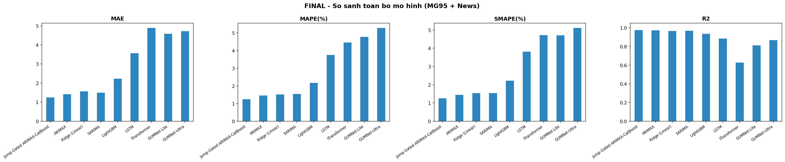

# Oil-Forecasting

**Forecasting four refined-fuel price series (MG95, MG92, DO 0.001%, DO 0.05%) with time-series and
machine-learning models — from global crude benchmarks, macro indicators, and news sentiment.**

[](https://www.python.org/)
[](https://pytorch.org/)
[](https://opensource.org/licenses/Apache-2.0)
[](https://jupyter.org/)

| | |
|---|---|
| **Targets** | MG95, MG92, DO 0.001%, DO 0.05% |
| **Horizons** | H = 1, 5, 10, 30, 60 trading days |
| **Models compared** | 9 (statistical, regression, boosting, deep learning, hybrid) |
| **Champion** | Jump-Gated ARIMAX → CatBoost |
| **Best score (MG95, H=1)** | **MAE 1.2571 · RMSE 2.6541 · MAPE 1.2615% · SMAPE 1.2603% · R² 0.9779** |
| **Data span** | 2008-05-01 → 2026-05-08 (daily) |

---

## Abstract

This report analyses and forecasts four price series — **MG95, MG92, DO 0.001%, DO 0.05%** — on daily
data from 2008-05-01 to 2026-05-08. We perform exploratory data analysis, build features, train **nine
models**, and evaluate at horizons **H1, H5, H10, H30, H60**. At **H1, Jump-Gated ARIMAX-CatBoost
achieves the lowest MAPE on all four products**. At longer horizons, ARIMAX leads in several cases.

---

## 1. Introduction

Domestic fuel prices are tied to world oil prices, the exchange rate, geopolitical risk, and the
price-adjustment schedule. The series shows a long-term trend, fast-moving volatility periods, and
stretches where the price is held flat. The problem therefore needs both the history of the series and
external drivers.

The project forecasts four products and compares nine trained models, from statistical and regression
models through gradient boosting to deep-learning and a hybrid model.

**Objectives**

- Describe the data with statistics and EDA charts.
- Build features from past prices, market variables, and daily news.
- Compare nine models on the same chronological split.
- Evaluate the four products at horizons 1, 5, 10, 30, and 60 days.
- Record which model suits each product and each horizon.

---

## 2. Data

The main dataset lives at `data/processed/clean_data_exo_ver1.csv` — **4,649 rows × 18 columns**, daily,
2008-05-01 → 2026-05-08, ordered by date and never randomly shuffled when splitting.

| Group | Main variables |
|---|---|
| **Targets** | MG95; MG92; DO 0.001%; DO 0.05% |
| **Fuel products** | MG97; NAPHTHA; KERO; FO 180 |
| **Crude** | WTI; BRT DTD; BRT KH; Brent_EU_Daily |
| **Economy & risk** | USD_Index; GPR |
| **Daily news** | per-topic news count, sentiment, and intensity |

Descriptive statistics of the targets:

| Statistic | MG95 | MG92 | DO 0.001% | DO 0.05% |
|---|---|---|---|---|
| Mean | 88.69 | 85.85 | 92.44 | 92.51 |
| Std | 25.86 | 25.46 | 29.53 | 30.43 |
| Min | 16.12 | 14.64 | 22.92 | 20.75 |
| Median | 84.33 | 81.67 | 87.02 | 87.40 |
| Max | 170.52 | 157.20 | 292.82 | 291.82 |

`daily_features.csv` stores news features aggregated per day. If a day has no news the value is filled
with 0 on join. News is a **supplementary** source — it does not replace prices and market variables.

---

## 3. Exploratory Data Analysis (EDA)

MG95 is used as the representative series; the same steps apply to the other three products.

### 3.1 Trend and volatility periods

MG95 and crude move together over many stretches. The 2008, 2014–2016, 2020, and 2022 episodes are clear.
The 2026 tail shows a fast increase, so test-region error can be affected by a price-regime change.


### 3.2 Correlation between variables

MG95 correlates highly with MG92, MG97, Brent, and WTI: **MG95–MG92 = 0.9988**, **MG95–BRT DTD = 0.9757**,
**MG95–WTI = 0.9483**. USD Index is negatively correlated; GPR is positive but lower.


### 3.3 Trend, seasonality, residual

The trend component shifts across periods. The 52-week seasonal component has a smaller amplitude than the
trend and the irregular shocks. Residuals rise in some periods — a trend/seasonality-only model cannot
describe the whole movement.


### 3.4 Stationarity

ADF on raw MG95: statistic **−3.1961**, p-value **0.0202**. After first differencing, p-value ≈ 0. This
supports differencing in ARIMA / SARIMA / ARIMAX.

### 3.5 Autocorrelation and lags

ACF decays slowly (today's price relates to many past values); PACF stands out at the early lags. From
this, the project builds lag features at **1, 2, 3, 5, 7, 14, 30** days and lets the statistical models
learn the lag structure.

### 3.6 Exogenous lead/lag

Within 0–20 days, USD Index peaks at **lag 1 (corr −0.4296)** and GPR at **lag 6 (corr 0.1644)**. These
guide feature design — they are not treated as proof of direct causation.


### 3.7 Anomalies and event context

By the IQR rule the series has one point above the upper threshold. The chart marks market shifts: the
2008 crisis, the 2014–2016 glut, COVID-19, and the Russia–Ukraine conflict. These explain why **RMSE can
rise faster than MAE** — a few days carry much larger errors.

---

## 4. Preprocessing & Feature Engineering

### 4.1 Chronological split

The data is split **80% train / 10% validation / 10% test** in time order — preserving past→future order
and avoiding leakage. After lags and rolling features, the modeling table has **4,619 rows × 52 columns**.

### 4.2 Feature groups

| Group | Examples & purpose |
|---|---|
| **Lags** | Lag 1, 2, 3, 5, 7, 14, 30 days; bring recent history into the model. |
| **Mean & volatility** | Rolling mean/std over 7 and 30 days; short trend and dispersion. |
| **Rate of change** | ROC 7 and 30 days; speed of price change. |
| **Price spreads** | Crack Spread and Brent–WTI Spread; relationships between series. |
| **Time** | Month, quarter, day-of-week, and sin/cos encodings. |
| **News** | Count, sentiment, intensity, and sums over 3 / 7 / 14-day windows. |
| **Price-change day** | Days since last price change, last change magnitude, change-day flag. |

Features are built in memory at run time; the raw file is read-only, and outputs are written to `results/`.

---

## 5. Models Trained

| Model | Role in the experiment |
|---|---|
| **SARIMA** | Time-series model with differencing and a seasonal component. |
| **ARIMAX** | ARIMA plus exogenous variables (WTI, Brent, USD Index, GPR). |
| **Ridge (Linear)** | Regularized linear regression on the engineered features. |
| **LightGBM** | Gradient-boosted trees; non-linear feature relationships. |
| **LSTM** | Sequential neural network over a past-data window. |
| **iTransformer** | Transformer for multivariate time series. |
| **GUMNet-Lite** | Compact version of GUMNet. |
| **GUMNet-Ultra** | Larger-configuration GUMNet. |
| **Jump-Gated ARIMAX-CatBoost** | ARIMAX baseline; CatBoost learns the residual and a gate adjusts on price-change signals. |

### 5.1 How the hybrid works

1. ARIMAX forecasts the baseline price from history and exogenous variables.
2. Compute the gap between the true price and the ARIMAX forecast on the training data.
3. CatBoost learns that gap from market, news, and price-change-state features.
4. A jump-detection branch decides how much correction to add to the final forecast.
5. Final forecast = ARIMAX forecast + CatBoost correction.

CatBoost does not merely check the error — it learns the error's pattern on the training set and produces
a correction for each new observation.

---

## 6. Evaluation Methodology

| Metric | Reading |
|---|---|
| **MAE** | Mean absolute error; lower is better. |
| **RMSE** | Penalizes large errors more; lower is better. |
| **MAPE** | Mean percentage error; **primary ranking metric**. |
| **SMAPE** | Symmetric percentage error; cross-checks MAPE. |
| **R²** | How well it tracks variation; near 1 is better, can be negative at long horizons. |

MAPE is used for ranking; RMSE flags large errors; R² shows how well the test variation is tracked.

---

## 7. One-Day-Ahead Results (H1)

MAPE (%) of all nine models on the four products (test set):

| Model | MG95 | MG92 | DO 0.001% | DO 0.05% |
|---|---|---|---|---|
| **Jump-Gated ARIMAX-CatBoost** | **1.2615** | **1.2548** | **1.4653** | **1.5225** |
| ARIMAX | 1.4614 | 1.4715 | 1.7058 | 1.7560 |
| SARIMA | 1.5520 | 1.5863 | 1.8091 | 1.8305 |
| Ridge (Linear) | 1.5080 | 1.5873 | 1.7813 | 1.8244 |
| LightGBM | 2.2007 | 2.5648 | 3.0889 | 3.0617 |
| LSTM | 3.8267 | 5.2887 | 5.9259 | 6.1785 |
| iTransformer | 4.7757 | 4.8925 | 7.5591 | 7.3254 |
| GUMNet-Lite | 4.7746 | 5.4247 | 7.1641 | 5.6150 |
| GUMNet-Ultra | 4.3884 | 3.8602 | 8.3510 | 4.9251 |

Champion (Jump-Gated ARIMAX-CatBoost) full metrics at H1:

| Product | MAE | RMSE | MAPE | SMAPE | R² |
|---|---|---|---|---|---|
| **MG95** | 1.2571 | 2.6541 | 1.2615 | 1.2603 | 0.9779 |
| **MG92** | 1.1906 | 2.4228 | 1.2548 | 1.2557 | 0.9782 |
| **DO 0.001%** | 1.9658 | 5.3796 | 1.4653 | 1.4686 | 0.9750 |
| **DO 0.05%** | 1.9925 | 5.3944 | 1.5225 | 1.5230 | 0.9718 |

Jump-Gated ARIMAX-CatBoost has the lowest H1 MAPE on all four products (1.2615% / 1.2548% / 1.4653% /
1.5225%), with R² between 0.9718 and 0.9782.



---

## 8. Multi-Horizon Results

Evaluated at H1, H5, H10, H30, H60. For each product and horizon, the best-MAPE model:

| Product | H | Best model | MAE | RMSE | MAPE | R² |
|---|---|---|---|---|---|---|
| MG95 | 1 | Jump-Gated ARIMAX-CatBoost | 1.2571 | 2.6541 | 1.2615 | 0.9779 |
| MG95 | 5 | Jump-Gated ARIMAX-CatBoost | 2.9059 | 5.5730 | 2.8978 | 0.9027 |
| MG95 | 10 | Jump-Gated ARIMAX-CatBoost | 3.9230 | 8.1304 | 3.8435 | 0.7929 |
| MG95 | 30 | ARIMAX | 6.3903 | 13.0368 | 6.0585 | 0.4995 |
| MG95 | 60 | ARIMAX | 7.1215 | 13.6076 | 6.7291 | 0.4904 |
| MG92 | 1 | Jump-Gated ARIMAX-CatBoost | 1.1906 | 2.4228 | 1.2548 | 0.9782 |
| MG92 | 5 | ARIMAX | 2.6628 | 4.7150 | 2.8170 | 0.9181 |
| MG92 | 10 | ARIMAX | 3.5741 | 6.8481 | 3.7289 | 0.8290 |
| MG92 | 30 | Jump-Gated ARIMAX-CatBoost | 5.3166 | 9.9418 | 5.4306 | 0.6343 |
| MG92 | 60 | ARIMAX | 6.4383 | 11.3896 | 6.4634 | 0.5752 |
| DO 0.001% | 1 | Jump-Gated ARIMAX-CatBoost | 1.9658 | 5.3796 | 1.4653 | 0.9750 |
| DO 0.001% | 5 | Jump-Gated ARIMAX-CatBoost | 4.8441 | 11.8112 | 3.6313 | 0.8799 |
| DO 0.001% | 10 | Jump-Gated ARIMAX-CatBoost | 7.2436 | 17.7918 | 5.3582 | 0.7276 |
| DO 0.001% | 30 | ARIMAX | 12.3889 | 29.3126 | 8.7928 | 0.3050 |
| DO 0.001% | 60 | Jump-Gated ARIMAX-CatBoost | 13.8569 | 31.8948 | 9.7652 | 0.1339 |
| DO 0.05% | 1 | Jump-Gated ARIMAX-CatBoost | 1.9925 | 5.3944 | 1.5225 | 0.9718 |
| DO 0.05% | 5 | Jump-Gated ARIMAX-CatBoost | 4.6942 | 12.2478 | 3.5254 | 0.8549 |
| DO 0.05% | 10 | Jump-Gated ARIMAX-CatBoost | 7.2547 | 18.3871 | 5.3860 | 0.6729 |
| DO 0.05% | 30 | ARIMAX | 11.7441 | 27.9128 | 8.4492 | 0.2914 |
| DO 0.05% | 60 | Jump-Gated ARIMAX-CatBoost | 12.5164 | 28.6092 | 9.2218 | 0.2167 |

For MG95 the hybrid leads at H1/H5/H10 and ARIMAX at H30/H60. For MG92 the hybrid leads at H1/H30 and
ARIMAX at H5/H10/H60. For both DO series the hybrid leads at H1/H5/H10/H60 and ARIMAX at H30.

Error grows with horizon: MG95's best MAPE rises from **1.2615% (H1)** to **3.8435% (H10)** and **6.7291%
(H60)**. The ~2% level only holds for very short-term forecasts on this dataset; H10 does not reach it.


---

## 9. Discussion & Limitations

### 9.1 By model group

ARIMAX and the hybrid have lower MAPE than the rest in most short-horizon cases — consistent with the data
structure: the series is strongly autocorrelated and related to WTI, Brent, USD Index, and GPR. Ridge and
SARIMA are useful baselines; LightGBM is mid-pack. LSTM, iTransformer, and the two GUMNet variants do not
reach the ARIMAX group's errors under the current configuration — a result that reflects this dataset,
split, and parameters.

### 9.2 Role of EDA

EDA surfaced three design-relevant facts: clear lag relationships, high correlation among oil series, and
periods of unusual volatility. Hence the project uses lags, rolling stats, exogenous variables, and an
error-correction term — not just a single trend line.

### 9.3 Limitations

- Daily-aggregated news loses some per-article information.
- A single train/validation/test split does not cover every market regime.
- Long-horizon forecasts are affected by future information not available at forecast time.
- Deep-learning results depend on configuration and number of training runs.

---

## 10. Conclusion & Future Work

The report covers four targets and nine trained models. At **H1, Jump-Gated ARIMAX-CatBoost has the lowest
MAPE on all four products**. At longer horizons no single model wins everywhere; **ARIMAX is lowest in
several cases**. The project therefore uses the hybrid for short-term forecasting and keeps ARIMAX as the
reference for longer horizons.

**Future work**

- Rolling (walk-forward) evaluation across multiple periods instead of one final test set.
- Separate EDA for MG92, DO 0.001%, DO 0.05% to check differences between series.
- Add the domestic price-adjustment calendar and a "days-to-next-adjustment" feature.
- Check news lag per topic and drop low-information columns.
- Tune per horizon while keeping one shared training/evaluation pipeline.

---

## 11. Tech Stack & Libraries

| Layer | Tools |
|---|---|
| **Language / runtime** | Python (DL environment), Node.js 22 (news crawler) |
| **Data** | pandas, numpy, scipy |
| **Statistical** | statsmodels (SARIMAX) |
| **ML** | scikit-learn, LightGBM, CatBoost, Optuna |
| **Deep learning** | TensorFlow / Keras (LSTM, iTransformer, GUMNet); PyTorch + neuralforecast (PatchTST, TFT) |
| **News sentiment** | OpenAI client → MiniMax-M3 (via TokenRouter) |
| **Viz** | matplotlib, seaborn |

Environment setup: `setup_env.ps1` / `setup_env.bat` + `requirements-py39.txt`, verified by
`verify_env.py`. See `SETUP.md`.

---

## 12. Project Structure

```
Oil-Forecasting/
├── README.md                  (this report)
├── SETUP.md                   environment setup guide
├── main.py                    full 4-target pipeline entry point
├── requirements-py39.txt      pinned dependencies
├── setup_env.ps1 / .bat       one-command environment setup
├── verify_env.py              environment checker
├── data/processed/            clean_data_exo_ver1.csv (market + macro panel)
├── src/                       data_loader, features, evaluation, models/
├── notebooks/                 01 EDA · 02 baseline · 03 all-models · 04 multi-horizon · 05 champion-improvements
├── news-crawler/              Node + Python news sentiment pipeline (crawl -> score -> aggregate)
├── results/                   metrics CSVs + charts/ (per-model & per-target)
└── docs/images/               figures used in this report
```

---

## References

1. Box, G. E. P., Jenkins, G. M., Reinsel, G. C., & Ljung, G. M. (2015). *Time Series Analysis: Forecasting and Control* (5th ed.). Wiley.
2. Hyndman, R. J., & Athanasopoulos, G. (2021). *Forecasting: Principles and Practice* (3rd ed.). OTexts. https://otexts.com/fpp3/
3. Seabold, S., & Perktold, J. (2010). *Statsmodels: Econometric and statistical modeling with Python*. SciPy 2010. https://www.statsmodels.org/
4. Pedregosa, F., et al. (2011). *Scikit-learn: Machine learning in Python*. JMLR, 12, 2825–2830. https://scikit-learn.org/
5. Ke, G., et al. (2017). *LightGBM: A highly efficient gradient boosting decision tree*. NeurIPS 30. https://lightgbm.readthedocs.io/
6. Prokhorenkova, L., et al. (2018). *CatBoost: Unbiased boosting with categorical features*. NeurIPS 31. https://catboost.ai/docs/
7. Hochreiter, S., & Schmidhuber, J. (1997). *Long short-term memory*. Neural Computation, 9(8), 1735–1780.
8. Liu, Y., et al. (2024). *iTransformer: Inverted transformers are effective for time series forecasting*. ICLR 2024.

---

## Contact

Mọi thắc mắc hoặc nhu cầu hợp tác nghiên cứu vui lòng liên hệ các tác giả của đồ án:

* **Nguyễn Hữu Tuấn Phát** - Email: [tuanphatnguyenhuu@gmail.com](mailto:tuanphatnguyenhuu@gmail.com)
* **Trần Mạnh Hùng**
* **Nguyễn Phước Toàn**
* **Giảng viên hướng dẫn**: TS. Hoàng Văn Quý
