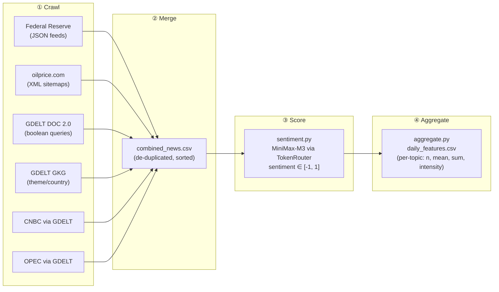

# News Crawler — War / Political Economy / Natural Disaster

Collects **datetime + headlines** for three themes and saves them as CSV, for use as
signals in the gasoline/oil price forecast. Zero npm dependencies; Node.js 22+.

## Pipeline overview



## Sources & coverage

| Source | Range | How | Notes |
|---|---|---|---|
| **Federal Reserve** | **2006 -> now** | Official JSON feeds (`ne-press.json`, `ne-testimony.json`) | Deep macro history; ~4,300 items. Mostly `political_economy`. |
| **oilprice.com** | **2009 -> now** | Public monthly XML sitemaps; headline from URL slug, exact `lastmod` | Energy-centric. |
| **GDELT** DOC 2.0 | **2017 -> now** | Boolean query per topic, English, date-windowed, ~25/day/topic | Broad global news. |
| **CNBC** (via GDELT) | **2017 -> now** | GDELT `domain:cnbc.com` filter | See note below. |
| **OPEC** (via GDELT) | **2017 -> now** | GDELT `domain:opec.org` filter | See note below. |

### Why CNBC and OPEC are pulled *through* GDELT, not scraped directly

- **CNBC** `robots.txt` explicitly disallows AI crawlers (`anthropic-ai`, `GPTBot`,
  `PerplexityBot`, `Amazonbot`), and its sitemaps only list recent articles — so it offers
  no 2008-era archive anyway.
- **OPEC** (opec.org) sits entirely behind Cloudflare bot-protection — every request,
  including the sitemap, returns HTTP 403.

GDELT already indexes both outlets, so filtering GDELT by their domain is the
ToS-respecting way to include their headlines (2017+).

> The Federal Reserve feed is what actually extends the dataset back to 2008 — it is the
> deepest, cleanest historical source here. oilprice.com adds energy depth to 2009. Before
> 2009, only the Fed stream is available from these sources.

## Project structure

```
news-crawler/
├── crawl.mjs                 main crawler entry point (CLI flags, source dispatch)
├── sentiment.py              LLM-based sentiment scorer (MiniMax-M3 via TokenRouter)
├── aggregate.py              roll up scored headlines to daily model features
├── .env.example              API key template (copy to .env)
├── .gitignore                ignores data/, .env, caches, node_modules/
│
├── lib/
│   ├── csv.mjs               CSV read/write helpers (append-safe, header-aware)
│   ├── fetch.mjs             HTTP fetch with retry, backoff, rate-limit handling
│   ├── topics.mjs            topic definitions & keyword lists (war, polit_econ, disaster)
│   └── gkg_topics.mjs        GKG theme queries & OPEC/OPEC+ country list
│
├── sources/
│   ├── fed.mjs               Federal Reserve press release & testimony fetcher
│   ├── gdelt.mjs             GDELT DOC 2.0 article search (+ CNBC/OPEC domain filters)
│   ├── gkg.mjs               GDELT Global Knowledge Graph themed fetcher
│   └── oilprice.mjs          oilprice.com monthly XML sitemap crawler
│
└── data/                     (git-ignored) all crawled/scored output
    ├── fed_news.csv
    ├── oilprice_news.csv
    ├── gdelt_news.csv
    ├── cnbc_gdelt_news.csv
    ├── opec_gdelt_news.csv
    ├── gkg_news.csv
    ├── combined_news.csv             merged & de-duplicated
    ├── combined_news_scored.csv      with sentiment column
    ├── daily_features.csv            final model input (one row/day)
    └── checkpoint.json               resumable crawl state
```

## Output columns

Columns: `datetime, date, source, topic, headline, url, domain, country`

- `datetime` — ISO-8601 UTC
- `topic` ∈ `war | political_economy | natural_disaster`
- `source` — origin identifier (e.g. `Fed`, `GDELT`, `oilprice`, `GKG`, `GKG-Country`)

`checkpoint.json` records finished windows so an interrupted run **resumes** — just re-run
the same command.

## Run

```bash
node crawl.mjs                         # full default run, ALL sources, 2008-05-01..2026-05-08
node crawl.mjs --source=fed            # Fed only (fast, deep history)
node crawl.mjs --source=oilprice
node crawl.mjs --source=gdelt --per-day=50
node crawl.mjs --source=cnbc           # CNBC via GDELT
node crawl.mjs --source=opec           # OPEC via GDELT
node crawl.mjs --source=gkg            # GKG themed pass
node crawl.mjs --topics=war,natural_disaster
node crawl.mjs --merge-only            # rebuild combined_news.csv from existing files
```

### Flags

| Flag | Default | Meaning |
|---|---|---|
| `--source` | `all` | `all` \| `fed` \| `oilprice` \| `gdelt` \| `cnbc` \| `opec` \| `gkg` |
| `--from` / `--to` | `2008-05-01` / `2026-05-08` | date range (YYYY-MM-DD) |
| `--per-day` | `25` | max GDELT headlines per day per topic |
| `--chunk-days` | `7` | GDELT time-window size |
| `--domain-chunk-days` | `30` | window size for CNBC/OPEC GDELT passes |
| `--topics` | all three | `war,political_economy,natural_disaster` |
| `--out` | `./data` | output directory |
| `--merge-only` | — | skip crawling, just rebuild combined CSV |

## Runtime expectations

- **Fed**: 2 requests, a few seconds. ~4,300 rows.
- **oilprice.com**: ~210 requests (~5 min for the full range).
- **GDELT** (broad): rate-limited ~1 req/5s; weekly × 3 topics over 2017–2026 ≈ 1,500
  requests ≈ **2 hours**. Resumable. Use `--chunk-days=30` for a ~4× faster, less dense run.
- **CNBC / OPEC** via GDELT: monthly windows × 3 topics ≈ 340 requests each (~30 min).

Recommended first run (deep history, fast): `node crawl.mjs --source=fed` then
`node crawl.mjs --source=oilprice`. Add the GDELT passes when you can let them run.

## Tuning topics

Edit `lib/topics.mjs`: `gdeltQuery` controls the GDELT boolean search; `keywords` controls
oilprice/Fed classification (substring match on headlines).

## Notes & limits

- oilprice headlines come from URL slugs, so punctuation is dropped ("Irans" not "Iran's");
  datetimes are exact.
- Fed timestamps are US-Eastern wall-clock; the `date` column is exact (intraday UTC offset
  not adjusted).
- A headline matching two topics appears once per topic.

---

## Sentiment scoring + daily features (MiniMax-M3)

Full pipeline: **crawl -> merge -> score -> aggregate**.

```bash
# 1. crawl (produces per-source CSVs + combined_news.csv)
node crawl.mjs --source=fed
node crawl.mjs --source=oilprice
# node crawl.mjs            # full run incl. GDELT/CNBC/OPEC (long, resumable)

# 2. (re)build the merged file if needed
node crawl.mjs --merge-only

# 3. score each headline -1..1 with MiniMax-M3
export TOKENROUTER_API_KEY=sk-...          # or put it in .env
pip install openai
python sentiment.py --in data/combined_news.csv --out data/combined_news_scored.csv

# 4. roll up to daily model features
python aggregate.py --in data/combined_news_scored.csv --out data/daily_features.csv --fill-gaps
```

### `sentiment` score (column added by sentiment.py)

A single value in **[-1, 1]**:

- **sign** = direction of impact on the economy / energy markets (escalation, disaster,
  bad data < 0 ; de-escalation, easing, growth > 0)
- **magnitude** = importance / severity (routine news ≈ 0.0 ; major market-moving events ≈ ±1.0)

So one number carries both *sentiment* and *importance*. Scored in batches with a local
cache (`*.sentiment_cache.jsonl`) — re-runs resume instantly and never re-pay for a headline
already scored. Tuning: `--batch` (headlines per API call), `--workers` (concurrency),
`--limit N` (quick test). The rating instructions live in `SYSTEM_PROMPT` inside the script.

> Note: MiniMax-M3 is a reasoning model (it "thinks" before answering); the scorer strips
> the `<think>` block and parses the JSON, with a generous token budget so output isn't cut off.

### `daily_features.csv` (model inputs)

One row per day. For each topic (`war`, `political_economy`, `natural_disaster`) and an
`all` bucket:

| Column | Meaning |
|---|---|
| `{topic}_n` | number of news items that day (**volume**) |
| `{topic}_sent_mean` | average sentiment (**mood**) |
| `{topic}_sent_sum` | sum of sentiment (**importance-weighted net signal**) |
| `{topic}_intensity` | sum of \|sentiment\| (**total attention/severity, unsigned**) |

`--fill-gaps` emits a row for every calendar day (zeros on quiet days) so the series aligns
cleanly with daily WTI/Brent prices for joining on `date`.

### Security

Your API key is read from `--api-key`, `$TOKENROUTER_API_KEY`, `$OPENAI_API_KEY`, or a local
`.env` (git-ignored). Keep it out of version control; rotate it if it has been shared.

---

## GKG source — OPEC+ / conflict / sanctions + OPEC-country focus

`--source=gkg` adds a GDELT **Global Knowledge Graph** themed pass (DOC 2.0 API, 2017+),
written to `gkg_news.csv`. Two passes:

1. **Theme/keyword topics** (`source = GKG`): `opec`, `conflict` (oil-relevant), `sanctions`
   (oil-relevant), and the GKG theme `oilprice_theme` (`theme:ECON_OILPRICE`).
2. **OPEC / OPEC+ country focus** (`source = GKG-Country`): one oil-focused query per member —
   Saudi Arabia, Iran, Iraq, UAE, Kuwait, Venezuela, Nigeria, Libya, Algeria, Angola (OPEC) and
   Russia, Kazakhstan, Mexico, Oman, Azerbaijan (OPEC+). The country is stored in the `topic`
   column as `country_<name>`.

```bash
node crawl.mjs --source=gkg                          # full GKG pass (2017 -> 2026-05-08)
node crawl.mjs --source=gkg --from=2026-05-08 --to=2026-06-23   # only the new gap
node crawl.mjs --source=gkg --per-day=50 --chunk-days=7         # denser
```

Edit queries/countries in `lib/gkg_topics.mjs`. Query rules baked in: one OR-group of ~6
short phrases per topic (GDELT rejects `(A)(B)` adjacency and over-long groups). The fetcher
now backs off automatically on GDELT rate limits (HTTP 429 or the 200+text form).

> GKG is included in `--source=all` as well. Output flows through the same scoring/aggregation
> pipeline (`sentiment.py` -> `aggregate.py`).
